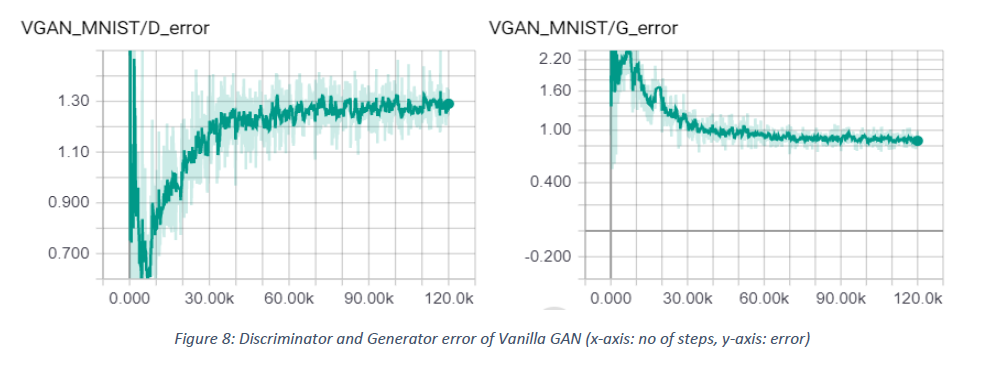

# Image Generation using Generative Adversarial Networks (GAN)

Implemented [Generative Adversarial Nets](https://arxiv.org/pdf/1406.2661.pdf) and [Unsupervised representation learning
with Deep Convolutional Generative Adversarial Networks](https://arxiv.org/pdf/1511.06434.pdf) papers to study generative adversarial networks and its application in data generation. 

GAN:
The basic idea of GANs is to set up a minimax game between two players. One of them is called the generator G. The
generator creates samples that are intended to come from the same distribution as the training data. The other player
is the discriminator D. The discriminator tries to distinguish real training data from synthetic images, and the generator
tries to fool the discriminator. Concretely, D and G play the following game on V (D, G):

The two players in the game are represented by two functions, each of which is differentiable both with respect to its
inputs and with respect to its parameters. The discriminator is a function D that takes ‘x’ as input and uses θ(D) as
parameters. The generator is defined by a function G that takes ‘z’ as input and uses θ(G) as parameters. J(D) and J(G) are
cost functions of discriminator and generator respectively.

Both players have cost functions that are defined in terms of both players’ parameters. The discriminator wishes to
minimize J(D)(θ(D), θ(G)) by controlling only θ(D). The generator wishes to minimize J(G)(θ(D), θ(G)) by controlling only θ(G).
Because each player’s cost depends on the other player’s parameters, but each player cannot control the other player’s
parameters, this scenario is most straightforward to describe as a game rather than as an optimization problem. The
solution to an optimization problem is a (local) minimum, a point in parameter space where all neighboring points have
greater or equal cost. The solution to a game is a Nash equilibrium.

### Implementations:
For detailed explanation about implementation please read Section 4.2 in [this](https://github.com/anant10/GAN-Text2Image-ReverseOCR/blob/master/Text%20to%20Image%20Synthesis%20using%20GAN%20Final%20Report.pdf) report.

#### 1. Vanilla GAN
This is the simplest type of GAN. Here the Generator and Discriminator are simple fully connected neural networks.

Details to build this network : [section 4.2.1](https://github.com/anant10/GAN-Text2Image-ReverseOCR/blob/master/Text%20to%20Image%20Synthesis%20using%20GAN%20Final%20Report.pdf)

#### 2. DEEP CONVOLUTIONAL GAN (DCGAN)
This is a successful implementation of GAN where generator and discriminators are deep convolutional neural
networks. They generate highly compelling images. The adversarial pair learns a hierarchy of representations from
object parts to scenes in both the generator and discriminators. The correlation between different object parts in a
scene is captured by CNN whereas fully connected layers failed at this.

Details to build this network : [section 4.2.2](https://github.com/anant10/GAN-Text2Image-ReverseOCR/blob/master/Text%20to%20Image%20Synthesis%20using%20GAN%20Final%20Report.pdf)

### Empirical results:
#### VANILLA GAN

Vanilla GAN takes huge number of iterations to generate distinguishable images which in turn consumes hours of
training time. We had to run at least 200 iterations to generate the images as shown in the second figure below. We
might achieve Nash equilibrium but with exhaustive number of iterations. We could not confirm an exact Nash
equilibrium is achieved. But we reached almost near to the equilibrium at epoch 200 with D(x) = 0.5411, D(G(z)) =
0.4193.
Here are some images generated by generator at multiple iteration steps:

The discriminator error is very high in the beginning. As time passes, discriminator gets better and its error decreases
till it reaches 0.5. The generator error increases, which shows that the discriminator can correctly classify the fake
samples.
With time, the generator gets better i.e. its error decreases. This results in increase of error of discriminator which
means that the generator is generating better images with time and discriminator is failing to identify them as fake
images.

#### DCGAN

DCGAN captures the correlation between different object parts in an image, hence better accurate image generation
results. We could achieve high quality image generation with only 10 iterations consuming 1/10th the training time of
vanilla GAN.
Here are some images generated by generator:

The discriminator and generator both have fluctuating errors. Even in the earliest stages, the discriminator loss is
fluctuating rather than increasing steadily. Over the period, the generated images are getting better but its not
capturing the noise as in the real data. That’s why Generator error is stagnant. With more and more epochs this
implementaion might achieve equilibrium. But in our case as we have noise in the real data(MNIST), the discriminator
is still able to identify some fake, due to lack of noise in generated images. When generator captures the noise
information and generates images with anticipated noise, discriminator and generator will achive nash equillibrium.
But this might take a long time. But our goal of generating better images is achieved before the equilibrium is even
reached.

.

## This project is the precursor to the next project : [Text to Image Generation](https://github.com/anant10/GAN-Text2Image-ReverseOCR).
The complete report is available [here](https://github.com/anant10/GAN-Text2Image-ReverseOCR/blob/master/Text%20to%20Image%20Synthesis%20using%20GAN%20Final%20Report.pdf)
